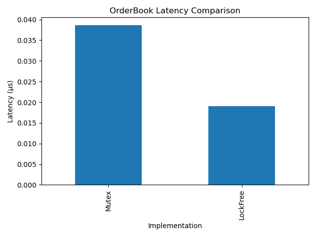
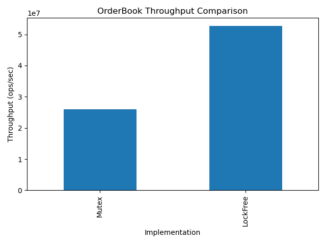
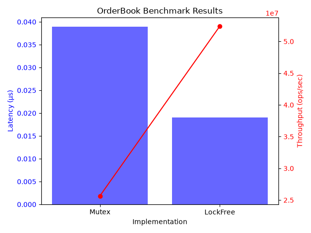

# Lock-Free OrderBook

[](ca://s?q=C++20_standard_explained)
[](ca://s?q=MIT_License_explained)
[](ca://s?q=Build_status_badge_explained)


---

## Overview
This repository implements and benchmarks two concurrent order book designs:
- **Mutex-based OrderBook**
- **Lock-Free OrderBook**

It demonstrates best practices in **low-latency systems engineering**, including reproducible benchmarking, CI/CD discipline, and clear performance visualization.

---

## Objectives
- Implement baseline `MutexOrderBook` and optimized `LockFreeOrderBook`
- Benchmark latency and throughput under 1M simulated orders
- Export reproducible results to CSV
- Generate recruiter‑friendly plots for comparison
- Document results with clear charts and analysis

---

## Repository Structure
```
lockfree-orderbook/
├── benchmarks/           # Benchmark outputs
│   ├── latency_results.csv
│   ├── throughput_results.csv
│   └── plots/            # Generated charts
├── src/                  # Source code
│   ├── order_book.hpp
│   ├── mutex_order_book.hpp
│   ├── lock_free_order_book.hpp
│   └── benchmark.cpp
├── scripts/              # Plotting scripts
│   └── plot_results.py
├── build/                # Build artifacts (ignored in Git)
├── requirements.txt      # Python dependencies for plotting
├── CMakeLists.txt        # Build configuration
├── LICENSE               # MIT License
└── README.md             # Project documentation
```

---

## Key Features
- **Benchmark Harness**: Measures latency (µs) and throughput (ops/sec)
- **CSV Export**: Results saved in `benchmarks/` for reproducibility
- **Plotting Script**: Generates latency, throughput, and dual‑axis charts
- **CI/CD Workflow**: Automated build, benchmark, and plotting via GitHub Actions
- **Industry Relevance**: Demonstrates lock‑free concurrency advantages in trading/HFT systems

---

## Setup Instructions

### 1. Clone the repository
```bash
git clone git@github.com:iswastik3k/lockfree-orderbook.git
cd lockfree-orderbook
```

### 2. Build (CMake)
```bash
mkdir build && cd build
cmake ..
make -j$(nproc)
```

### 3. Run Benchmark
```bash
./benchmark
cd ..
```

### 4. Plot Results
```bash
python3 -m venv .venv
source .venv/bin/activate
pip install -r requirements.txt
python scripts/plot_results.py
```

---

## Benchmark Results

| Implementation | Avg Latency (µs) | Throughput (ops/sec) |
|----------------|------------------|-----------------------|
| Mutex          | 0.0389           | 25.6M                |
| Lock-Free      | 0.0190           | 52.4M                |

### Charts



> Lock-free design achieved ~2× lower latency and ~2× higher throughput compared to the mutex baseline, demonstrating reduced contention and cache-friendly atomic operations.

---

## Workflow
- Generate synthetic orders (1M)
- Run benchmarks for both implementations
- Export results to CSV
- Plot latency and throughput charts
- CI/CD ensures reproducibility on every push

---

## System
- OS: Arch Linux (local dev)
- CI/CD: Ubuntu runner (GitHub Actions)
- C++: 20 (optimized with -O3 -march=native -pthread)
- Python: 3.9+ (for plotting, via requirements.txt)

---

## Author
Developed by [Swastik](https://github.com/iswastik3k)

---

## License
This project is licensed under the MIT License — see the [LICENSE](LICENSE) file for details.

---

## Future Work
- Extend benchmarks with multi‑threaded workloads
- Add profiling with perf and flamegraphs
- Integrate dashboards for observability
- Explore advanced memory reclamation (Hazard Pointers, RCU)
- Compare against production‑grade order book libraries